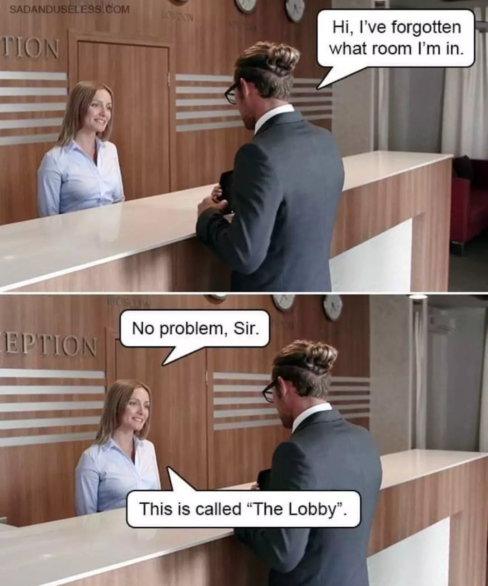
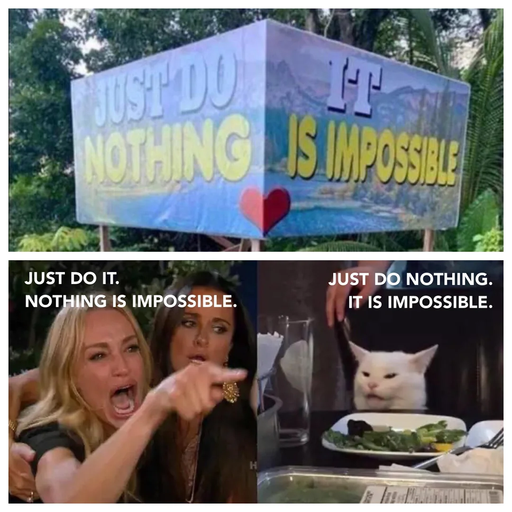
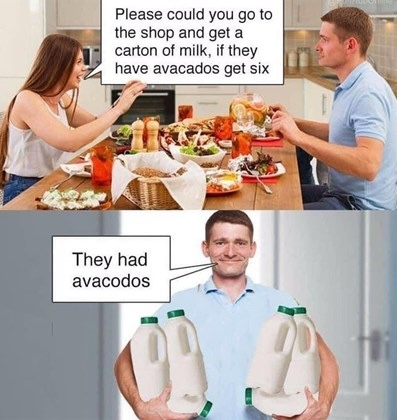

# Refresher

**Pragmatics** is the study of how context contributes to meaning; the study of implied meaning 

- implied meaning =/= literal meaning (semantics)

--

**Presuppositions** are a type of implied meaning

- information that must be assumed to be in the *common ground* for an utterance to make sense

--

Today we're adding **Conversational implicatures**!

- These are a type of implied meaning that arises from our understanding of how people behave in conversation

---

class: middle, center

# Grice: "How do conversations work?"

---

# Grice: "How do conversations work?"

- Philosopher Paul Grice (1913-1988) studied how people behave when they're having a conversation.

- He noticed that participants in a conversation tend to collaborate and follow certain rules.

--

- some examples of these common rules:

  - not saying things that are irrelevant 
  
  - not saying things they believe to be false
  
  - not saying more or less than they need to

---

# Cooperative Principle

We tend to behave in similar ways whenever we're collaborating on a common task with a common goal with other people.

--

- Imagine Keng is baking a cake with his mom:

  - When she tells him the next step is to stir the batter, he's probably not going to start doing jumping jacks instead. 

  - When she asks him to hand her two eggs, he's probably not going to hand her twenty, or just one.

--

In the same way, when we have a conversation, we tend not to say irrelevant things or give more or less information than is required

---

# Cooperative Principle

Grice named this general tendency to cooperate the **Cooperative Principle**

- *"Make your contribution such as is required, at the stage at which it occurs, by the accepted purpose or direction of the talk exchange in which you are engaged."*

  - ...participants in a conversation tend to say what's appropriate for the situation and goals of the conversation

---

# Cooperative Principle

The Cooperative Principle was then broken up into four Maxims of Conversation

--

## The Maxims of Conversation

- **Maxim of Quantity:** be informative!

- **Maxim of Quality:** be truthful!

- **Maxim of Relevance:** be relevant!

- **Maxim of Manner:** be clear!

--


...even though they sound like commands, they're supposed to *describe* how people *typically* behave in conversation

---

class: middle, center

# The Maxims (preview)

---

# Maxims

***Maxim of Quantity.*** Be informative!!!

- don't say *more* or *less* than you need to 


--

***Maxim of Quality.*** Be truthful!!!

- don't say what you believe to be false or what you don't have evidence for

--

***Maxim of Relevance.*** Be relevant!!!

- don't say irrelevant things

--

***Maxim of Manner.*** Be clear!!!

- don't be obscure, ambiguous, or too wordy

- provide information in a sensible order

---

# Maxims of conversation

In conversation, we generally assume participants are following the Cooperative Principle with these four conversational maxims.

This helps us make sense of people's utterances, especially when their literal words appear to be breaking the maxims.

--

For example:

- **Speaker A:** Do you want to go out tonight?

- **Speaker B:** I have an exam in the morning.

---

# Maxims of conversation

For example:

- **Speaker A:** Do you want to go out tonight?

- **Speaker B:** I have an exam in the morning.

Taken *literally,* B appears to be saying something unrelated to the topic A brings up

--

- B violated the **Maxim of Relevance**?

--

By not answering A's question, B also appears to provide less information than A has asked

--

- B violated the **Maxim of Quantity**?

---

# Conversational Implicatures 

What if we assume B **is** still being cooperative and following Grice's maxims?

For this to make sense we have to infer that B intends some additional meaning beyond what has literally been said – something that is both relevant and informative

--

- *"I can't go out,* ***because I have an exam*** *" :(*

With this implied meaning, B satisfies the two maxims that seem to have been violated:

--

- **Maxim of Relevance:** the implied meaning is relevant to the topic of discussion

- **Maxim of Quantity:** the implied meaning provides an answer to A's question

---

# Conversational Implicatures

This type of implied meaning is called a **Conversational Implicature**!

- ...implied meaning that can be inferred from assuming speakers are following the Cooperative Principle and the maxims of conversation.

---

class: middle, center 

# Maxim of Quality

---

# Maxim of Quality 

- **Do not say what you believe to be false**

- **Do not say things you don't have adequate evidence of**

--

- Generally, when people talk, they don't lie to each other the whole time... because conversation would never work if they did!

--

  - **Note:** "adequate evidence" depends on the situation. 

- *A doctor would be held to a higher standard of evidence than a random person when discussing disease outcomes*

---

# Maxim of Quality

So when someone tells us something, we generally infer that the information is true and reliable.

- **Sandy:** We need someone to make some sort of cake for the picnic

- **Tom:** I can make my family's favorite chocolate cake

Because we assume Tom is following the Maxim of Quality, it causes the following implicatures:

--

- Tom is being truthful: he actually knows how to make the cake.

- Tom has evidence: he has succeeded in making the cake in the past.

Were any of these things literally said? 

--

- **No!** They're just implicatures!

---

class: middle, center

# Violating and flouting conversational maxims 

---

# Violating and flouting maxims

We just saw that people don't always follow conversational maxims

- when people lie or make claims without having evidence for it, they are **violating** the maxim of quality

People can also **flout** a maxim

- **flout a maxim:** violate in a way that you *expect listeners to notice* 

  - this is usually done to add sarcastic or comedic effect with what you're saying 
  
---

# Violating and flouting maxims

For example:

Imagine someone flouted the Maxim of Quality by saying the following when there's a hurricane raging outside:

- "Lovely weather we're having!"

What are they implicating?

---

class: middle, center

# Maxim of Quantity

---

# Maxim of Quantity

- **Make your contribution as informative as is required**

- **Do not make your contribution more informative than is required**

- We tend to assume people have given us the appropriate amount of information 

--


**Enrico:** What languages do you speak?

**Maria:** I speak English, Spanish, and Mandarin.


.pull-left[
This utterance would still be literally true if Maria could also speak Arabic, but it'd sound weird 

- Why is that?

]

.pull-right[
```{r, out.height="60%", out.width="60%", echo=FALSE}
knitr::include_graphics("./images/wasp.jpg")
```
]


---

# Maxim of Quantity 

Some examples...

- **Mother:** Have you done your homework for all your classes yet?

- **Son:** I've finished my history homework.

--

What is the son implicating?

--

.pull-left[

- **Rafa:** What do you do for a living? 

- **Ed:** I work.


Why is Ed's response awkward? 

What might Ed be implicating by flouting the Maxim of Quantity?
]

.pull-right[
```{r, out.height="60%", out.width="60%", echo=FALSE}

```
]


---

class: middle, center 

# Maxim of Relevance 

---

# Maxim of Relevance 

**Be relevant!**

We generally assume that people will say things relevant to the current topic of conversation.

Note that we can change the topic without violating this maxim, as long as we signal that to our listeners:

- **A:** How was the movie? 

- **B:** Actually, there's something I wanted to talk to you about.

--

B is not being relevant, but they've signaled their desire to change the topic with "actually"


---

# Maxim of Relevance 

As we saw earlier, assuming that people are being relevant helps us make sense of people's utterances.

- **Alana:** Is Tony dating anyone these days?

- **Sam:** She goes to Philadelphia every weekend.

--

Assuming Sam is being relevant, what are they implicating?

---

# Maxim of Relevance

Another example...

--

Suppose Mike asks a professor for a letter of recommendation to grad school in Biochemistry.

In academics, there's an expectation that letters of recommendation will be long and detailed, with many examples of why the person is a good candidate and a lot of direct praise.

- Mike's professor writes **"Mike has good handwriting and dresses neatly."**

--

Is this relevant to a grad school application? What is the professor implicating?

--


- This shows that we often rely on implied meanings like implicatures because it would be rude or inappropriate to say everything literally

---

class: middle, center 

# Maxim of Manner 

---

# Maxim of Manner

.pull-left[
- **avoid obscurity of expression**

  - don't be hard to understand 
  
- **avoid ambiguity**

- **be brief** 

  - don't be too wordy
  
- **be orderly**

  - present information in an order that makes sense

]

.pull-right[
```{r, out.height="100%", out.width="100%", echo=FALSE}

```
]


---

# Maxim of Manner

**Compare...**

- Rebecca took the medication and had an allergic reaction.

- Rebecca had an allergic reaction and took the medication.

--

These two sentences say *literally* the same thing. But assuming the speaker is being orderly, what does each sentence implicate about the relationship between the medication and the allergies?

--

**"Be brief"** assumes that speakers won't be too wordy. Consider the following:

- Miss Singer produced a series of sounds corresponding closely to the score of an aria from Rigoletto.

--

Why is the critic being so wordy? Why didn't they simply say Miss Singer sang beautifully? What are they implicating?

---

class: middle, center

# Practice

---

# Practice (identify implicatures)

Identify the conversational implicatures in the following dialogues. (In other words, what is Jeff really saying, or why is he saying it the way he does?) Identify the maxims that lead to each implicature.

1. **Laura:** Did you mow the grass and wash the car like I told you? 

  **Jeff:** I mowed the grass.

2. **Laura:** Did John make a doctor's appointment?

  **Jeff:** Their line was busy 

3. **Laura:** What are your plans for this afternoon?

  **Jeff:** I was going to take the dog for a W-A-L-K.

4. **Laura:** When will you finish your work? 

  **Jeff:** I have band practice tonight.

5. **Laura:** Where's your car? 

  **Jeff:** Aliens took it while I was asleep.

---

class: middle, center

# Is it an implicature?

---

# Cancelling and reinforcing implicatures 

One test for implicatures is that they can be cancelled and reinforced, but literal meaning cannot.

--

What do the following utterances implicate:

1. **A:** What languages does Anna
  
  **B:** Anna speaks English, Korean, and Farsi.

2. Ian ate a cake and was happy.

3. **A:** Does Sue have any siblings? 

  **B:** Sue has a brother.

---

# Cancelling implicatures 

These utterances raise the following implicatures. Can you think of a statement that you could add each of the utterances that would **contradict** the implicature? For example:

--

*Anna speaks English, Korean, and Farsi.* ***In fact, she also speaks Greek.***

--

1. **A:** What languages does Anna speak?
  
  **B:** Anna speaks English, Korean, and Farsi.

2. Ian ate a cake and was happy.

1. **A:** Does Sue have any siblings? 

  **B:** Sue has a brother.

---

# Cancelling implicatures 

Implicatures can be cancelled or defeated: you can add extra information to the statement that contradicts the implicature and makes it go away.

--

For example... 

- Anna speaks English, Korean and Farsi. **In fact, she also speaks Greek.**

  - Implicature: ~~Anna speaks only these three languages~~
  
- Ian ate a cake and was happy. **In fact, he ate the cake** ***because*** **he was happy**

  - Implicature: ~~Ian ate a cake and that made him happy~~

- **A:** Does Sue have any siblings?

  **B** Sue has a brother. **In fact she has two brothers.**
  
  - Implicature: ~~Sue only has one brother~~


---

# Reinforcing implicatures

These utterances raise the following implicatures. Now can you think of a statement that you could add each of the utterances that would support the implicature? 

For example, *"Anna speaks English, Korean, and Farsi. And she doesn't speak any others."*

1. **A:** What languages does Anna speak? 

  **B:** Anna speaks English, Korean and Farsi

2. Ian ate a cake and was happy

3. **A:** Does Sue have any siblings? 

  **B:** Sue has a brother 
  
---

# Canceling and reinforcing literal meaning 

.pull-left[
Canceling and reinforcing are important **tests** for literal **vs.** implied meaning, because you can generally cancel and reinforce implicatures, but **not** literal meaning.

If you try to cancel or reinforce **literal meaning**, you'll end up with a statement that's either **contradictory** or **repetitive**!
]

.pull-right[
```{r, out.height="100%", out.width="100%", echo=FALSE}

```
]

---

# Cancelling and reinforcing literal meaning

**cancelling** and **reinforcing** are important tests for literal **vs.** implied meaning


- **literal meaning** *cannot* be cancelled or reinforced

- but **implicatures** can be

***"Merlin speaks English, Kazakh and Mandarin" ***

- ...*"but he does not speak Kazakh"*

  **cancelling = contradiction**
  
- ...*"and he speaks Kazakh"*

  **reinforcing = redundancy**
  


---

class: middle, center

# Practice

---

# Practice

For each sentence, two additional statements are given – one is part of the sentence's literal meaning, one is an implicature. Try to reinforce/cancel each statement to test whether it is literal or an implicature.

--

.pull-left[

1. I drove home at noon.
  
  - **A:** I drove a car.
  
  - **B:** I drove home during the day.

2. I called 10 times and nobody picked up.
  
  - **A:** I called at least 5 times.
  
  - **B:** I was using a phone.
]


.pull-right[
```{r, out.height="90%", out.width="90%", echo=FALSE}

```
]

---

class: middle, center

# Summary 

---

# Summary 

**Cooperative Principle:** People in a conversation tend to cooperate by following certain rules.

--

**Conversational Maxims:** Quality, Quantity, Relevance, Manner

--

**Conversational Implicatures:** Implied meanings that arise from the assumption that speakers are
following the cooperative principle.

--

- This is sometimes because people's words implicate things beyond what they literally say.

--

- It's sometimes because people deliberately flout the maxims for ironic or comedic effect.

--

- People use implied meaning as a way to avoid saying uncomfortable things, or just to avoid the effort of saying things literally.

---

# Coming up: Phonetics!

### Reading 

- read the **phonetics chapter** on Canvas 

### Homework 

- HW5 is due **Nov 2**!

- HW6 will be published this week and will be due **Nov 9**!

